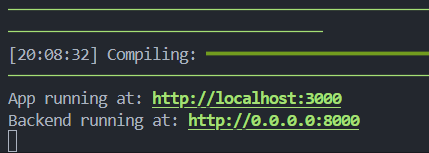
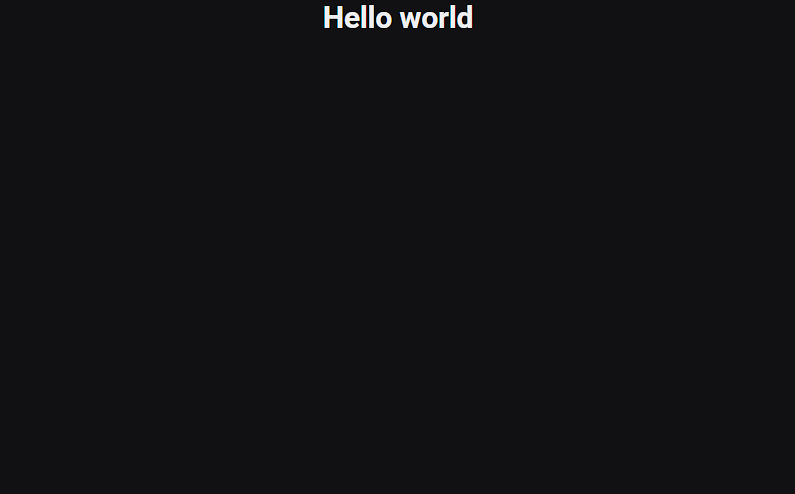
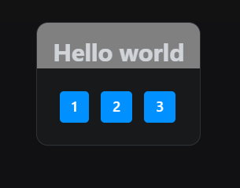
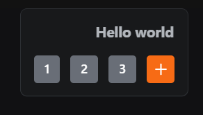

# REFLEX CALCULATOR

Learn how reflex works and wich best practices you need to know to build web apps with REFLEX.

## 1. Use reflex CLI to start a new project

To use **reflex**, you need to Create a new virtual environment in python and install the **reflex** package.

### a. Create a virtual environment

In python is recommended to use virtual environments if you are working on a new project, this allows you to have a copy of the libraries that you are using on your project.

Every package that you install in the virtual environment is only in the directory that you are working on and it's not installed globally on your computer.

- Execute this command to create a new virtual environment
  ```bash
  python -m venv .venv
  ```

### b. Activate virtual environment

Every time when you are going to work on your project again, is necessary to activate the virtual environment. Don't forget to use this command to activate your project.

- Linux and MacOS
  ```bash
  source .venv/bin/activate
  ```
- Windows (powershell)
  ```powershell
  .venv/scripts/activate
  ```

### c. Install Reflex on your virtual environment

```bash
pip install reflex
```

### d. Create a new Reflex app

Execute `reflex init` to create a new app

This command install Node Js and create the .web directory to manage the frontend with javascript of your Reflex UI.

```bash
reflex init
```

- Select option 0 (press enter) to use a blank template.
  

This create a project with the following directory structure:

```
├── assets
├── rxconfig.py
├── reflex_calcultor
    ├── __init__.py
    ├── reflex_calcultor.py
```

## 2. Prepare your project

At this point your main reflex file have this example code:

```python
"""Welcome to Reflex! This file outlines the steps to create a basic app."""
import reflex as rx
from rxconfig import config

class State(rx.State):
    """The app state."""
    ...

def index() -> rx.Component:
    # Welcome Page (Index)
    return rx.container(
        rx.color_mode.button(position="top-right"),
        rx.vstack(
            rx.heading("Welcome to Reflex!", size="9"),
            rx.text(
                "Get started by editing ",
                rx.code(f"{config.app_name}/{config.app_name}.py"),
                size="5",
            ),
            rx.link(
                rx.button("Check out our docs!"),
                href="https://reflex.dev/docs/getting-started/introduction/",
                is_external=True,
            ),
            spacing="5",
            justify="center",
            min_height="85vh",
        ),
        rx.logo(),
    )

app = rx.App()
app.add_page(index)
```

Change your main file just like this to have a cleaner code in your project and leave the necessary lines on it.

```python
import reflex as rx
from rxconfig import config

app = rx.App()
```

Create a `components` and `pages` folder on your directory, these folders will help you organize your files and reuse code.

Here is how you directory structure is right now

```bash
├── assets
├── rxconfig.py
├── reflex_calcultor
    ├── components
    ├── pages
    ├── __init__.py
    ├── reflex_calcultor.py
```

## 3. Create Index Page

**REFLEX** allows you to manage routes using the `rx.page` decorator.

- Create a python file called `index.py` in the `pages` folder with this content:

  ```python
  import reflex as rx


  @rx.page(route="/", title="Home", description="My first app using reflex")
  def index() -> rx.Component: # every page or component must have to return a reflex component
      return rx.center(  # rx.center is a div with justify center property in HTML
          rx.heading("Hello world"),
          direction="column",  # direction is like flex direction on CSS
      )
  ```

- Import index page on you main file

  ```python
  import reflex as rx
  from rxconfig import config
  from .pages.index import index

  app = rx.App()
  ```

- Run your project to see the result, execute this command:
  ```bash
  reflex run
  ```
  
  

## 4. Create your first component

Just like React or any javascript framework, in **REFLEX** you can make your own components but using 100% python.

Let's create our first component to make a calculator.

- In `components` folder create a new folder called `calculator`.
- Create `container.py` file, here is the component to wrap the calculator screen and buttons on a container.
- Create `calculator.py`. This file will be used to call the parent component

```bash
├── components
    ├── calculator
        ├── calculator.py
        ├── container.py
```

### a. Container component

Add this in `container.py`

```python
import reflex as rx


def calc_container(*args): # *args is used to accept as many parameters as you want
    return rx.card(
        rx.inset( # inset is used to act as a screen
            rx.heading(
                "Hello world",
                padding_x="1rem",
                padding_top="1rem",
                color_scheme="gray",
                size='3'
                align="right",
            ),
            side="top",
            pb="current",
        ),
        rx.vstack(args), # vstack is a div with flex direction column, is used to nest all the components that are passed as parameter
        size="3",
    )
```

### b. Parent component

Import cointainer component on ``calculator.py``.

The ``calculator`` function encapsultes all child components and their functionalities.

```python
import reflex as rx
from .container import calc_container

def calculator():
    return calc_container(
        rx.hstack(
            # some buttons as example
            rx.button('1'),
            rx.button('2'),
            rx.button('3'),
        ),
    )
```

### c. Import Parent Component
To use your component you must hace to import it into the page you are going to use it on.

* Import in ``pages/index.py``.
    ```python
    ...
    from ..components.calculator.calculator import calculator

    ...
    def index() -> rx.Component:
        return rx.center(
            calculator(), # <-- your new component 👍
            ...
        )
    ```
    

## 5. Create Children Components
Ahora que ya esta creado un pequeño boceto de nuestra aplicacion es necesario añadir un poco de estilos algo más de estética a nuestro componente.

Vamos a crear un componente para los botones de la calculadora que sera una plantilla para crear nuevos botones.

En la ``components/calculator`` crea un archivo llamado ``buttons.py``

```python
import reflex as rx

def number_button(number:str, on_click=None): # on_click por defecto es nulo, despues agregaremos un evento a los botones
    return rx.button(
        number,
        color_scheme='gray', # para algunos componentes, reflex permite personalizarlos sin usar css
        on_click=on_click # el parametro on click se utiliza para añadir un evento al botón
    )

def operation_button(icon_name:str, on_click=None):
    return rx.icon_button(
        icon_name,
        color_scheme='orange',
        on_click=on_click
    )
```

En ``calculator.py`` importaremos los botones nuevos y los agregaremos al componente principal.
```python
import reflex as rx
from .container import calc_container
from .buttons import number_button, operation_button

def calculator():
    return calc_container(
        rx.hstack(
            number_button('1'),
            number_button('2'),
            number_button('3'),
            operation_button('plus')
        ),
    )
```

Ahora nuestra calculadora se ve asi:

